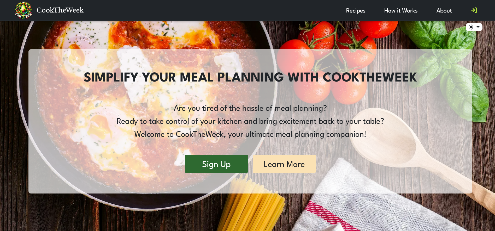
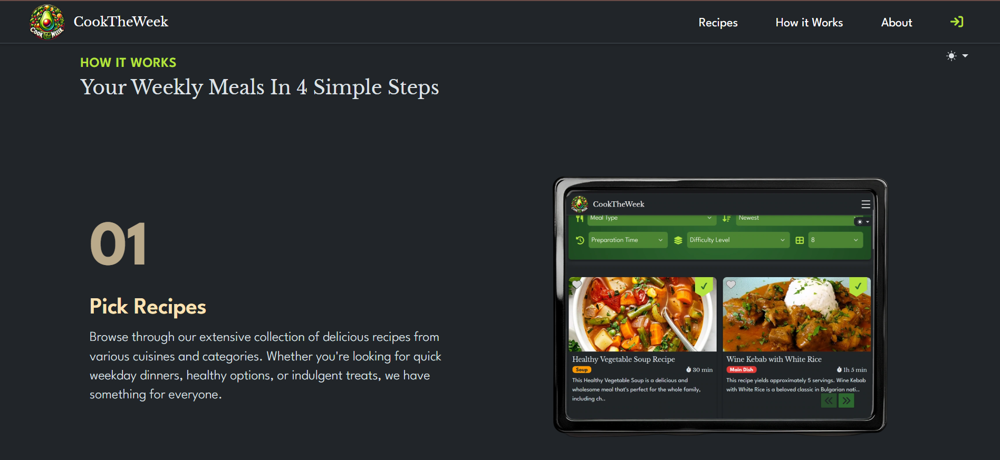
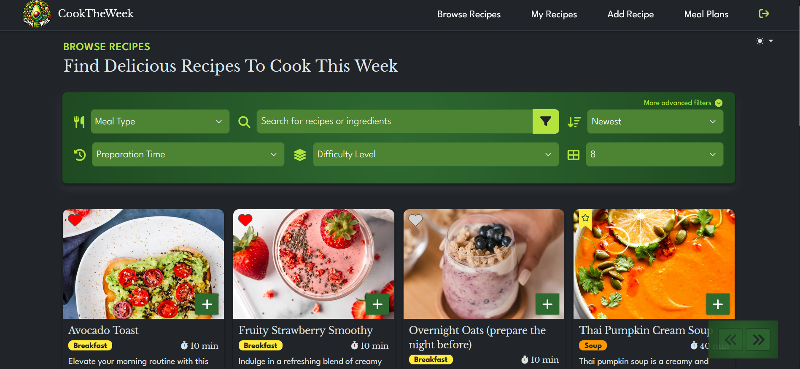
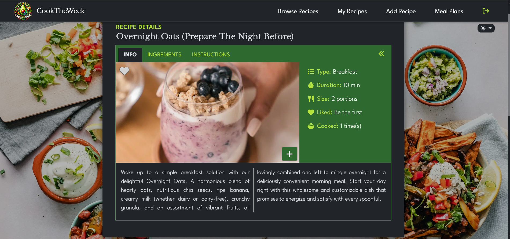
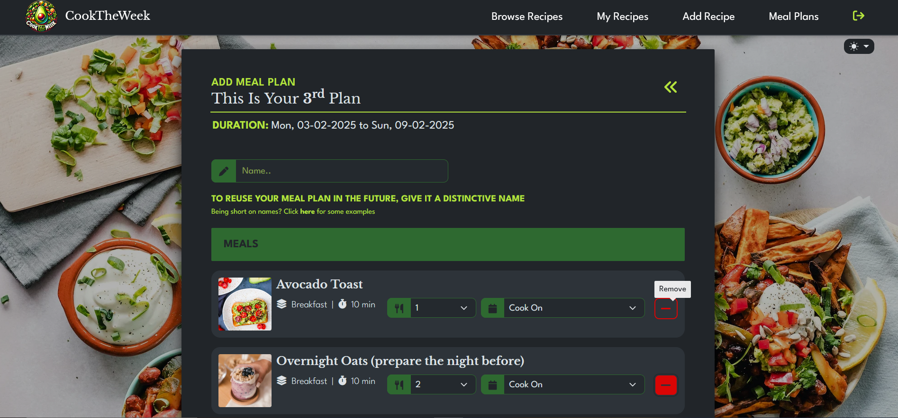
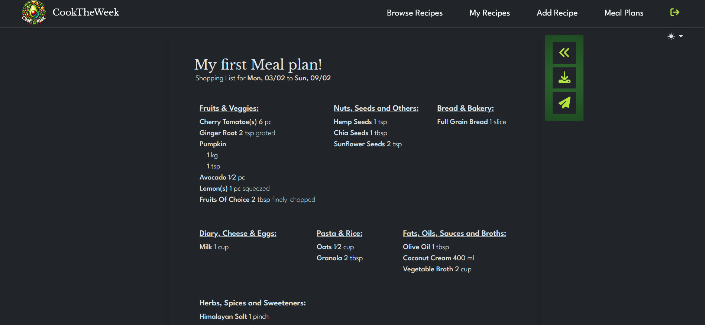
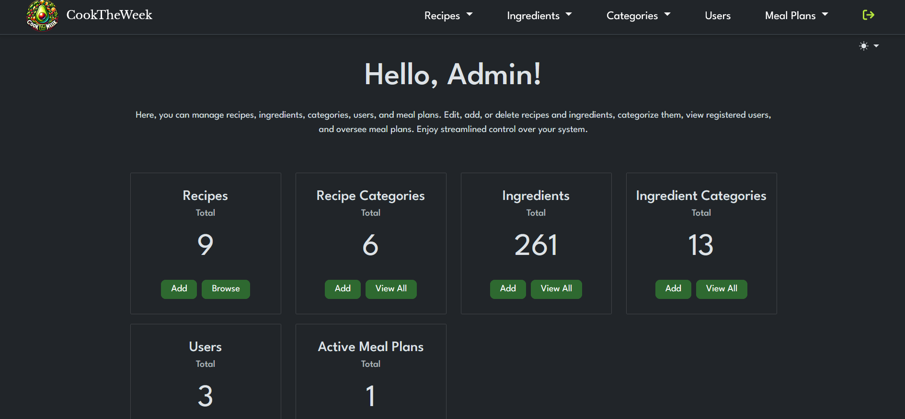
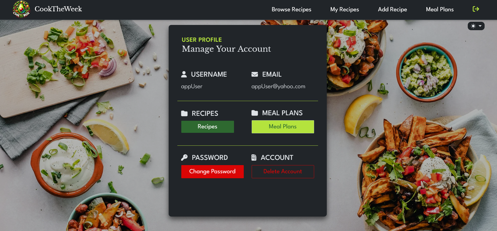
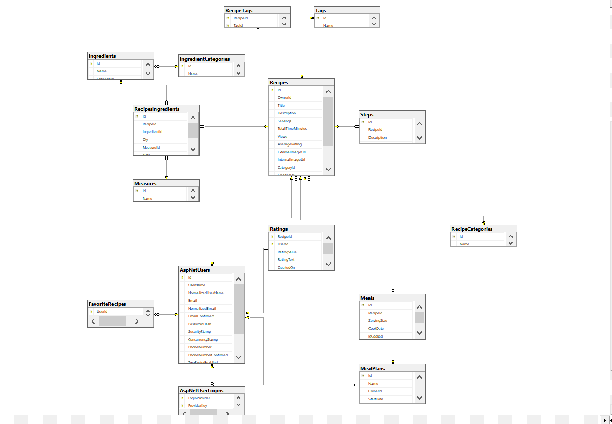

# 🍽️ Cook The Week

Plan Your Weekly Meals with Ease!

## 📖 About The Project

Cook The Week is a **.NET 8-based web application** designed to help users **plan, organize, and manage weekly meals**. The application features **recipe management, meal planning, and automatic shopping list generation**.

This app runs on **ASP.NET Core**, uses **Entity Framework Core for database management**, and utilizes **Hangfire for background job scheduling**. The database is **automatically created and seeded on first launch**—no manual migrations needed!

---

## 🛠️ Features

- ✅ **User-Added & Site Recipes** – Browse, search, and manage recipes.
- ✅ **Secure Authentication** – Users can sign up manually or use external logins (Google or Facebook).
- ✅ **Editable & Reusable Meal Plans** – Users can modify and reuse meal plans as needed.
- ✅ **Shopping Lists** – Easily generate downloadable or email-ready shopping lists with a single click.
- ✅ **Admin Dashboard** – Manage all recipes, categories, and user contributions.
- ✅ **Background Jobs (Hangfire)** – Automated meal plan claims updates and cleanup.

---

## 📸 Screenshots

### 🏠 Home Page – Welcome message and call-to-action buttons.



### ℹ️ How It Works – A step-by-step guide on using the app effectively.



### 🔎 Browse Page – Featured recipes, filters, and pagination.



### 📜 Recipe Details Page – Ingredients, instructions, and description.



### 🗓️ Add Meal Plan Page – Create, edit, and reuse meal plans from selected recipes.



### 🛒 Shopping List – Download or email your grocery list in one click.



### 🔧 Admin Panel – Manage and oversee recipes, categories, and user contributions. Add/Edit/Delete Ingredients, Categories, etc.



### 👤 User Dashboard – Track saved recipes and meal plans.



---

## 🛠️ Tech Stack

### 🖥️ Frontend

- **SASS (SCSS)** – Advanced styling with variables, mixins, and modular CSS.
- **Bootstrap** – Responsive and mobile-friendly design.
- **jQuery & JavaScript** – Interactive UI components and dynamic UI bindings.
- **KnockoutJS** – Client-side validation and dynamic UI bindings.

### ⚙️ Backend

- **ASP.NET Core (.NET 8)** – The main backend framework.
- **Entity Framework Core** – Database management with SQL Server.
- **Hangfire** – Background job scheduling and task automation.

### 📂 Database & Storage

- **SQL Server** – Relational database for storing recipes, users, and meal plans.
- **Cloudinary** – Image processing and storage for recipe images.

### 📧 Email & Reports

- **SendGrid** – Emailing service for sending shopping lists and notifications.
- **Rotativa** – PDF generation for downloading meal plans and shopping lists.

### 🔑 Authentication & External Logins

- **ASP.NET Identity** – Secure user authentication and account management.
- **External Logins** – Support for Google, Facebook, and more.

---

## 🚀 Getting Started

### 🔧 Prerequisites

Before running the application, ensure you have the following installed:

- [.NET 8 SDK](https://dotnet.microsoft.com/download/dotnet/8.0)
- [SQL Server](https://www.microsoft.com/en-us/sql-server/sql-server-downloads) (Local or Azure SQL)
- [Azure Account (Optional)](https://azure.microsoft.com/en-us/free/)

---

### 💻 Installation & Setup (using CLI)

#### 1️⃣ Clone the repository 

```bash
git clone https://github.com/yana-hris/cook-the-week.git
```

After cloning is done, open Visual Studio and navigate to the project folder. Navigate inside the cook-the-week folder and open the solution CookTheWeek.Web.sln:


#### 2️⃣ Configure the Database Connection
In the Solution Explorer find the WEB folder and inside CookTheWeek.Web project select the appsettings file. Navigate to its Developer version.


Open `appsettings.Development.json` and update the `ConnectionStrings` section with your database details. For Windows Authentication:
```json
{
  "ConnectionStrings": {
  "CookTheWeekDbContextConnection": "Server=YOUR_SERVER_NAME\\SQLEXPRESS; Database=CookTheWeekDB; Integrated Security = true; Encrypt = false; MultipleActiveResultSets=True;"
  }
}
```

Optionally if using SQL Server account instead of Windows Authentication, update the connection string like this:
```json
{
  "ConnectionStrings": {
  "CookTheWeekDbContextConnection": "Server=YOUR_SERVER_NAME\\SQLEXPRESS; Database=CookTheWeekDB; User Id=YOUR_USERNAME; Password=YOUR_PASSWORD; Encrypt=false; MultipleActiveResultSets=True;"
  }
}
```

#### 3️⃣ Run the Application

Navigate to the Startup project folder:
```bash
cd CookTheWeek.Web
```
Start the application:
```bash
dotnet run
```

#### 4️⃣ Access the App in Your Browser

```bash
http://localhost:7170
```

Login with some of the pre-seeded users nd start exploring the app:
### 👤 Admin User Credentials

> Username:

```bash
adminUser
```

> Password:

```bash
admin1
```

### 👤 App User Credentials

> Username:

```bash
appUser
```

> Password:

```bash
123456
```

## Database Diagram:



## Acknowledgements

- Fontawesome - Icons used in the application.
- Pexels.com - Images used in the application.

## Contact

For any feedback, don't hesitate to reach out:

- Email: yana.hristova.work@gmail.com


